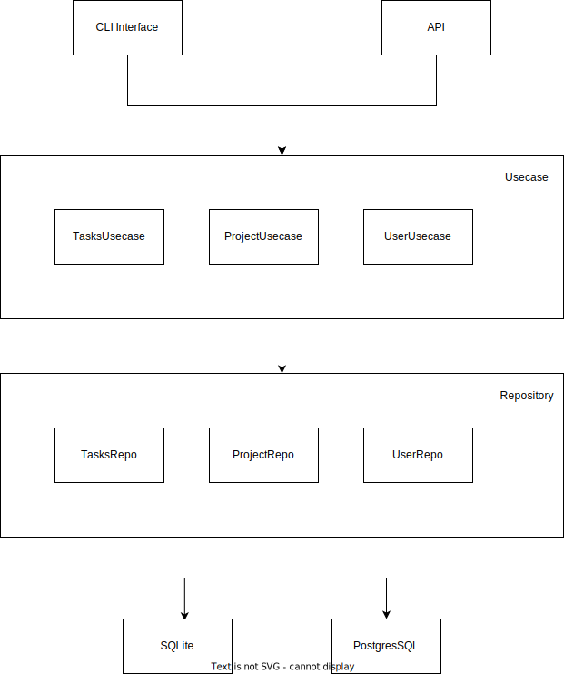

# Технические характеристики

- Бекенд на golang
- Консольный UI на golang (с аналогом ncurses)

Стек: 
Сервер:
- Golang 
- PostrgeSQL
- Можно сюда Redis для сессионных ключей, если времени хватит
- Раскатка через Docker

Клиент: 
- Golang (gocui)
- SQLite для локального хранения данных

Верхнеуровневое разбиение на компоненты: 
- Репозитории задачи, проекта и пользователя
- Юзкейсы задачи, проекта и пользователя
- Транспортные уровни - UI и HTTP REST API

# Верхнеуровневая диаграмма

# Диаграммы контроллеров и классов хранения данных 

