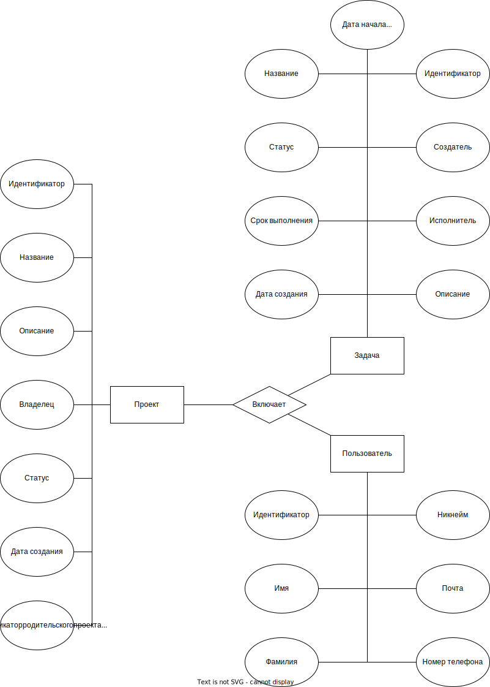

# Лабораторная работа 1
## Предметная область
На рынке уже имеется большое число трекеров задач. К классическим можно отнести - Jira, Trello, Todoist, MS Todo и т.д. Также есть несколько ориентированных на терминал приложений, таких как Taskwarriod, TODO.md, Ultralist. Проект Jirno относится к второму типу, но старается взять от классических удосбство интерфейса и возможность работы с проектами.

## Аналогичные решения. 

К похожим решениям можно отнести следующие проекты 
- Singularity
- Taskwarrior 

| Решение | Интерфейс | Работа с проектами | Просмотр всех своих задач общим списком |
| --- | ----------- | ---- | --- | 
| Singularity | Desktop/Web | Да | Нет | 
| Taskwarrior | CLI | Нет | Нет | 
| Jirno | CLI | Да | Да | 

## Use-Case диаграмма

## ER-диаграмма сущностей

## Архитектурные характеристики, важные для проекта. 

1. Легкая модифициуемость
2. Полноценная работа в офлайне
3. Безопасность
4. Простота в освоении

## Требования к проекту

1. Наличие работы с источником/хранилищем данных;
2. Наличие пользовательского интерфейса;
3. Наличие как минимум 2 сущностей предметной области;
4. Наличие как минимум 2-х экранов пользовательского интерфейса;
5. Семантическая «база» проекта любая – курсовой по КГ, БД, будущий диплом, старта®

