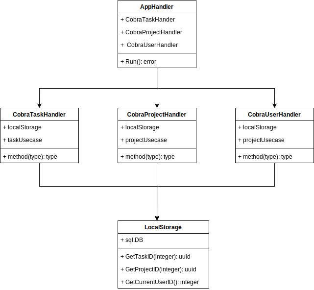

1. UML-диаграммы классов для компонента/модуля, связывающего GUI и бизнес-логику и компонента/модуля GUI (для выбранного технологического стека и паттерна – Controller, Presenter, ViewModel и др.);

2. UML-диаграмма классов для технологического UI ко всем функциям системы (консольное приложение)s

